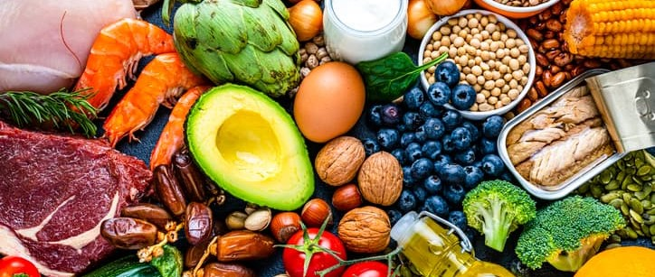

# Nutrition-Food-Insight-Analysis-Competition 🏆

  </img>

This notebook is part of a DataCamp competition. You can access it through the following link: https://app.datacamp.com/workspace/w/9d9933bf-ba27-44e3-a6e5-b0a96e707d82.

## The challenge 📝
Create a report that covers the following:
- Which fruit has the highest vitamin C content? What are some other sources of vitamin C?
- Describe the relationship between the calories and water content of a food item.
- What are the possible drawbacks of a zero-carb diet? What could be the drawbacks of a very high-protein diet?
- A gram of fat has around 9 kilocalories, and a gram of protein and a gram of carbohydrate contain 4 kilocalories each. Fit a linear model to test whether these estimates agree with the data.
- Analyze the errors of your linear model to see what could be the hidden sources of calories in food.

## The data 💾
The dataset for this competition was sourced from the USDA's FoodData Central website.
This data contains the calorie content of 7,793 common foods, as well as their nutritional composition. Each row represents one food item, and nutritional values are based on a 100g serving. Here is a description of the columns:
- FDC_ID: A unique identifier for each food item in the database.
- Item: The name or description of the food product.
- Category: The category or classification of the food item, such as "Baked Products" or "Vegetables and Vegetable Products".
- Calories: The energy content of the food, presented in kilocalories (kcal).
- Protein: The protein content of the food, measured in grams.
- Carbohydrate: The carbohydrate content of the food, measured in grams.
- Total fat: The total fat content of the food, measured in grams.
- Cholesterol: The cholesterol content of the food, measured in milligrams.
- Fiber: The dietary fiber content of the food, measured in grams.
- Water: The water content of the food, measured in grams.
- Alcohol: The alcohol content of the food (if any), measured in grams.
- Vitamin C: The Vitamin C content of the food, measured in milligrams.

## The solution 🎯
### 1) Exploratory Data Analysis (EDA) 🔍
- Correcting data fields.
- Checking for out-of-range values.
- Checking for duplicated data.
- Checking for missing data.
- Addressing Question 1.
- Addressing Question 2 using a regression model fit with lmplot by category.
### 2) Handling missing values 🧩
- Calculate the percentage of missing values by category to determine which ones can be dropped and which ones cannot.
- Extract relevant insights about the data distribution by category to determine the appropriate imputation method for handling missing values.
### 3) Addressing Question 3: Details in the Notebook
### 4) Addressing Question 4
- Fit a regression model.
- Compare the coefficient of the fitted model with the formula provided by the Cleveland Clinic website.
### Addressing Question 5
- Analyze the residuals between the model predictions and the true values provided in the dataset
- Discover if there are other sources of hidden calories using residuals for individual nutritional components.
- Determine which food category contributes more to the highest and lowest residual values.
### PCA analysis
- Determine whether the optimal number of features for the model is the three as determined by the Cleveland Clinic website.

